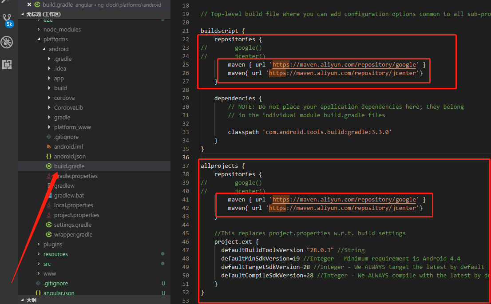
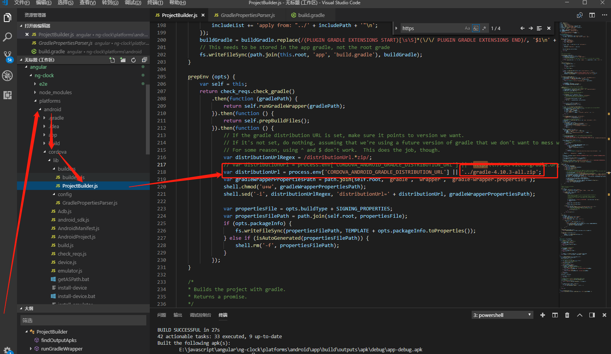
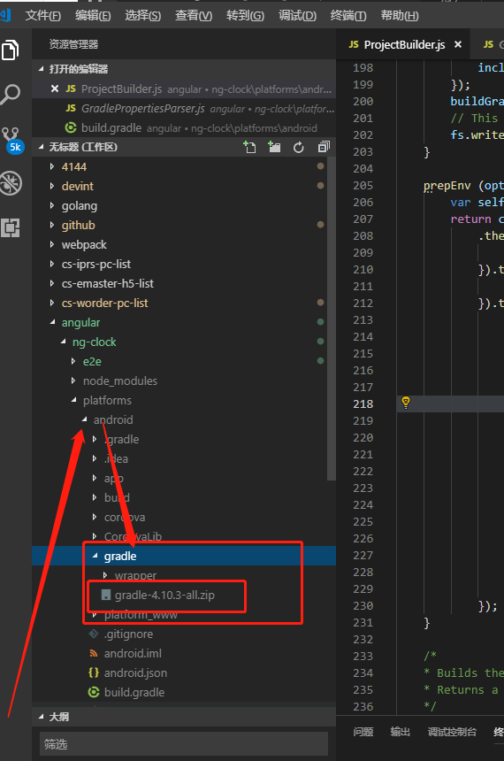

---

---




 1 ------ 如图所示文件在build 前或后

```
google()
jcenter()
```

修改为：

1. ```
   maven { url 'https://maven.aliyun.com/repository/google' }
   maven{ url 'https://maven.aliyun.com/repository/jcenter'}
   ```

2 --------    修改    gradle.zip



var distributionUrl = process.env['CORDOVA_ANDROID_GRADLE_DISTRIBUTION_URL'] || 'https\\://services.gradle.org/distributions/gradle-4.10.3-all.zip';

改为

var distributionUrl = process.env['CORDOVA_ANDROID_GRADLE_DISTRIBUTION_URL'] || '../gradle-4.10.3-all.zip';

手动下载  gradle-4.10.3-all.zip  文件压缩包于当前目录下用于   var distributionUrl = process.env['CORDOVA_ANDROID_GRADLE_DISTRIBUTION_URL'] || '../gradle-4.10.3-all.zip';   语句加载，防止墙下载不了


