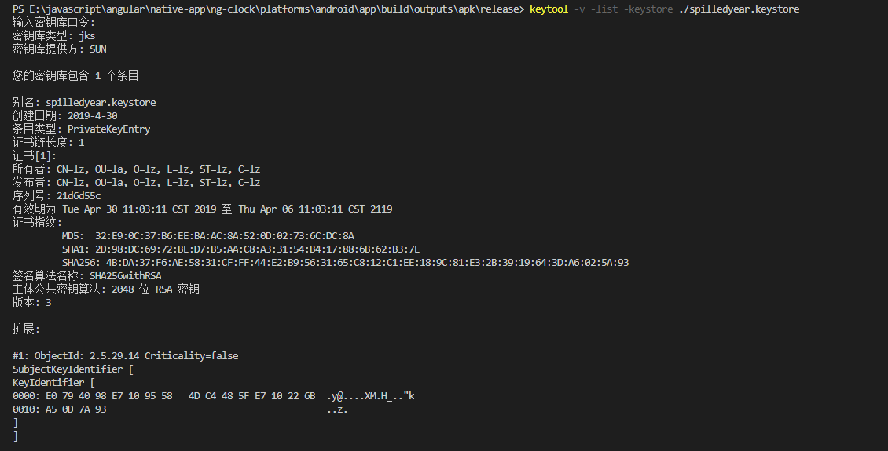

1 <https://lbs.amap.com/api/android-location-sdk/guide/create-project/get-key/>

2 获取android版本 SHA1: 在对应的 xxx.keystore 目录下 cmd 输入  keytool -v -list -keystore ./xxx.keystore



有效期为 Tue Apr 30 11:03:11 CST 2019 至 Thu Apr 06 11:03:11 CST 2119
证书指纹:
         MD5:  32:E9:0C:37:B6:EE:BA:AC:8A:52:0D:02:73:6C:DC:8A
         SHA1: 2D:98:DC:69:72:BE:D7:B5:AA:C8:A3:31:54:B4:17:88:6B:62:B3:7E
         SHA256: 4B:DA:37:F6:AE:58:31:CF:FF:44:E2:B9:56:31:65:C8:12:C1:EE:18:9C:81:E3:2B:39:19:64:3D:A6:02:5A:93
签名算法名称: SHA256withRSA
主体公共密钥算法: 2048 位 RSA 密钥
版本: 3

3  安装插件    

```
cordova plugin add cordova-plugin-gaodelocation-chenyu --variable  ANDROID_API_KEY=your android key --variable  IOS_API_KEY=your ios key
npm install --save @ionic-native/gao-de-location

ANDROID_API_KEY： 安卓的高德地图key
IOS_API_KEY: ios 的高德地图key
```